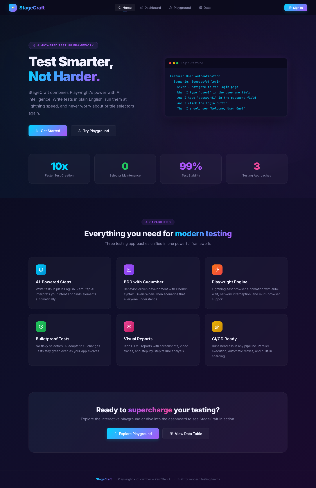
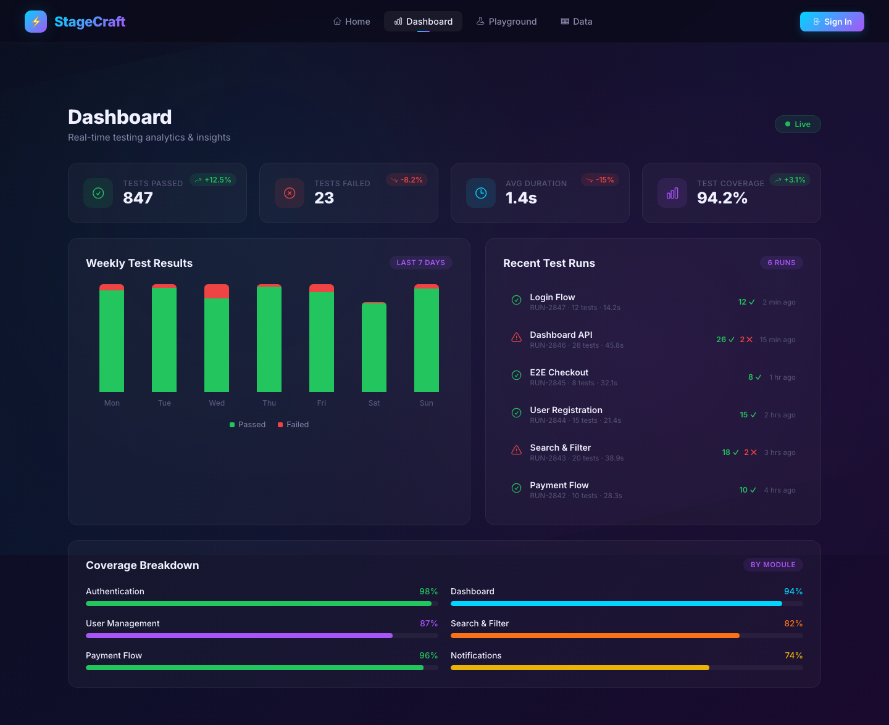
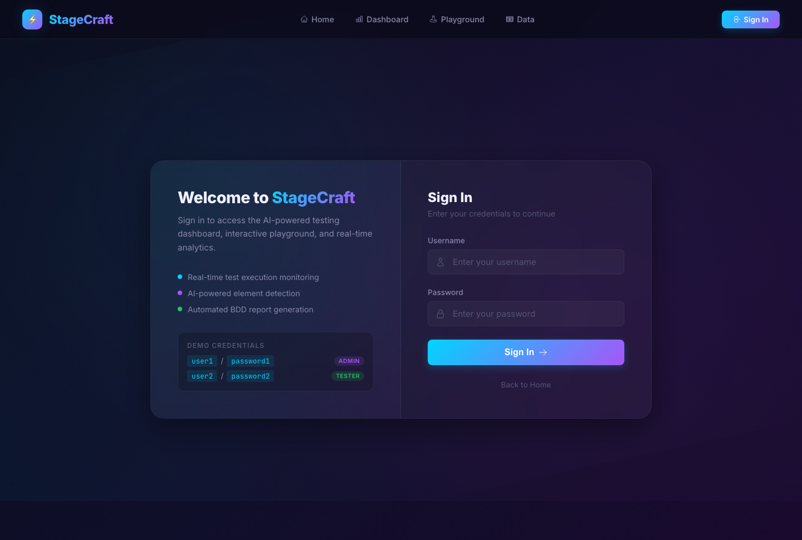
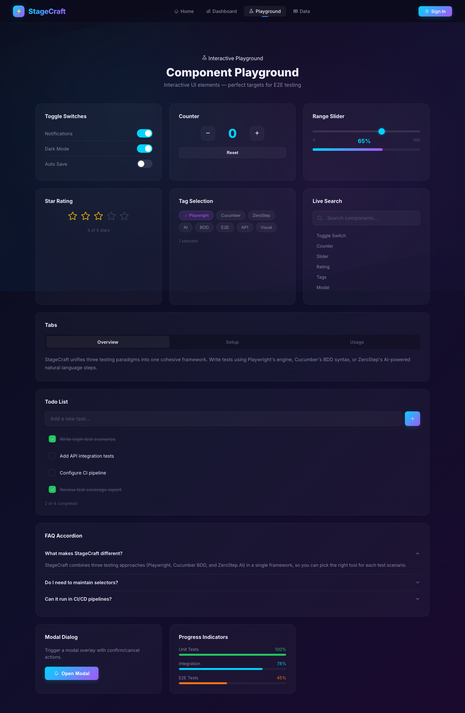
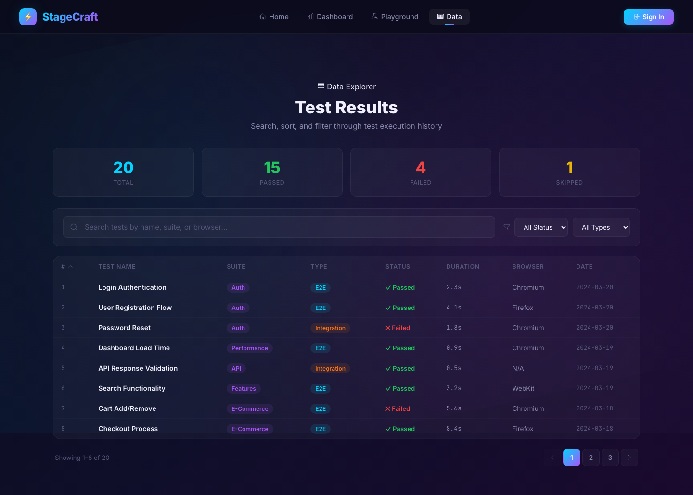

# StageCraft

AI-powered end-to-end testing framework built with [Playwright](https://playwright.dev), [Cucumber BDD](https://cucumber.io), and [ZeroStep AI](https://zerostep.com). Includes a feature-rich React demo app as the test target.

## Screenshots

### Home Page


### Dashboard


### Login


### Interactive Playground


### Data Table


## Tech Stack

- **Playwright** v1.44 — browser automation engine
- **Cucumber** — BDD test runner (`.feature` files + step definitions)
- **ZeroStep** — AI-powered natural language test steps
- **React 18** — feature-rich demo frontend (test target)
- **Framer Motion** — page transitions & animations
- **React Icons** — icon library (Heroicons v2)

## Structure

```
.
├── docs/                         # Screenshots & documentation assets
├── backend/
│   └── playwright-api/           # Playwright + Cucumber test suite
│       ├── tests/                # Playwright spec files
│       ├── features/             # Cucumber .feature files
│       └── steps/                # Step implementations
└── frontend/
    └── playwright-front/         # React demo app (test target)
        └── src/
            ├── App.js            # Root app with routing & navigation
            ├── Home.js           # Landing page with hero & features
            ├── Login.js          # Glassmorphic login form
            ├── Logout.js         # Logout confirmation
            ├── Dashboard.js      # Analytics dashboard with charts
            ├── Playground.js     # Interactive UI components
            └── DataTable.js      # Searchable, sortable data table
```

## Quick Start

### 1. Start the frontend

```bash
cd frontend/playwright-front
npm install
npm start
# App runs on http://localhost:3000
```

### 2. Run Playwright tests

```bash
cd backend/playwright-api
npm install
npx playwright install
npx playwright test
```

### 3. Run Cucumber BDD tests

```bash
cd backend/playwright-api
npm run test:cucumber
```

## Demo Credentials

| Username | Password    | Role   |
| -------- | ----------- | ------ |
| `user1`  | `password1` | Admin  |
| `user2`  | `password2` | Tester |

## Pages & Features

| Page         | Route         | Description                                                   |
| ------------ | ------------- | ------------------------------------------------------------- |
| Home         | `/`           | Hero section, feature cards, stats, CTA                       |
| Login        | `/login`      | Split-panel glassmorphic login with validation                 |
| Logout       | `/logout`     | Animated logout confirmation                                  |
| Dashboard    | `/dashboard`  | Stats cards, bar chart, recent test runs, coverage breakdown   |
| Playground   | `/playground` | Toggles, counter, slider, rating, tags, tabs, todos, accordion, modal |
| Data Table   | `/data`       | Searchable, sortable, filterable table with pagination        |

## Testing Approaches

1. **Pure Playwright** — Standard spec files with auto-wait and assertions
2. **Cucumber BDD** — Gherkin feature files with Given/When/Then step definitions
3. **ZeroStep AI** — Natural language test steps without manual selectors

## Design

- Dark theme with animated gradient mesh background
- Glassmorphism UI with subtle blur effects
- Cyan/purple/pink accent palette
- JetBrains Mono for code, Inter for UI text
- Fully responsive across all breakpoints
